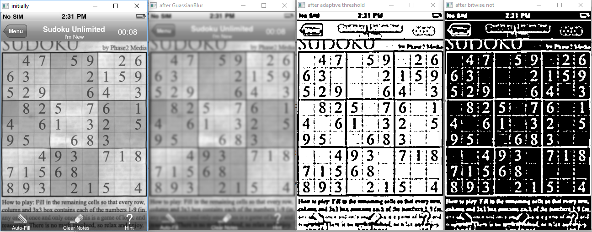
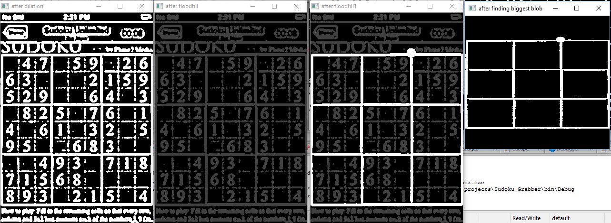
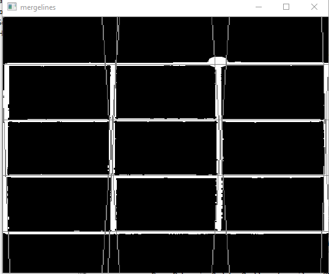
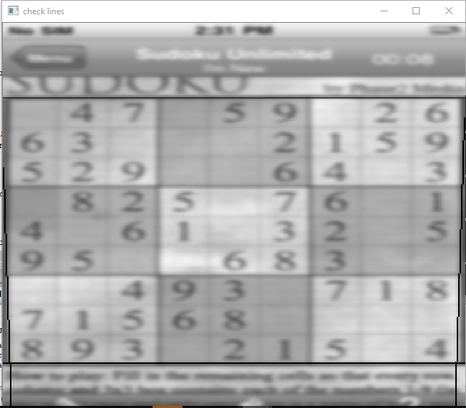
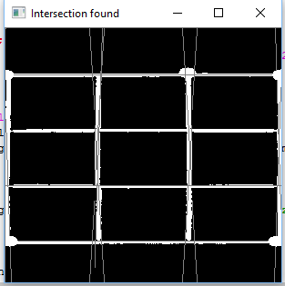
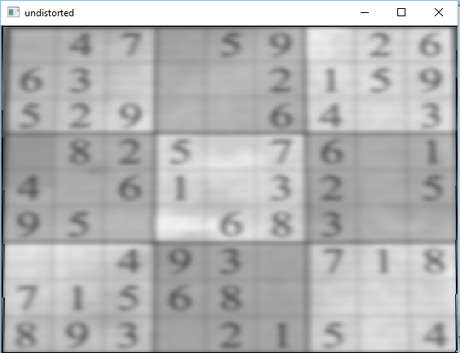

# SudokuReader
Detects the outer boundaries of a sudoku in a given image without using in-built library functions

## Steps:-
<b>
<ul>
  <li>Gaussian Blur:-Any image would have a little noise. To do away with this to avoid its problems in the later stage, gaussian blur was used.(others are mean filter,weighted average filter). I chose gaussian filter as it affects the nearest neighbours the most.</li>
   
  <li>Adaptive Threshold:-If the image is taken in bad lighting, there might be variation in the illumination in various parts of the image. It's called adaptive threshold as it calculates a threshold over several small windows in the image. So it keeps the illumination independent. If a pixel has a value greater than the mean in the small window it will be made white else black.</li>
   
  <li>Bitwise Not:-It is done to get black as a background,and weight in the foreground.</li>
   
  <li>Dilation:- We would notice small breakage in lines due to the quality of image taken. So one line would be considered as 2 or three because of the breakage. Hence dilation is used to fill or join the lines nearby. An appropriate kernel can be used to do so.</li>
   
  
   
  <li>Flood-Fill:-This function return the a bounding rectangle of the pixels it filled. I have assumed that the biggest rectange in the image would be the sudoku. So, I applied flood fill from every point on the sudoku which was white in color. The one's which had textual info and others, gave very small areas. The one which gave the biggest area was the sudoku. The blobs formed from other points are made black. Hence now we have the sudoku. The process is still not completed as the sudoku is not bounded by geometrical lines.</li>
   
  <li>Point which is the cause for the largest area</li>
   
  
   
  <li>Find lines geometric lines on the image using Hough Transform:-To find lines, I have used hough transform. It is a technique which transforms each line in the xy space to a point on the mc space , and a point in the xy plane to a line in the mc plane. Hence for each point you have a line in the mc plane. So 3 or 4 points on an approximately straight line from the raw image will intersect at a particular averaged line in the mc space. this m,c is used to construct the geometrical line for the approximated line in the averaged image. It returns an array of lines with r,and theta as parameters. We can find m,c from basic geometric interpretations and draw a line using the line function in opencv</li>
   
  
  
   
  <li>Merge Lines which have nearest slopes:-Merging lines:- But as a result of the previous step there are too many lines representing the same line. Merging line was done based on the theta value of the lines. If the line is approximately horizontal , I found a point on the extreme left and a point on the extreme right. For every other line, I compared with the current line, if they are very close, I delete the other line.Similar thing done for vertical lines.</li>
   
  <li>Finding extreme lines:- Categorize lines based on vertical and horizantal and update extreme intercept variables</li>
   
  
   
  <li>Crop the image:- normal geometric method find intersection points. Based on these 4 points we can warp the image</li>
   
  
